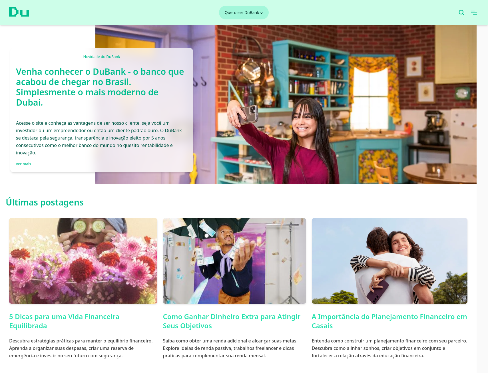

# Angular Blog

This project is an example blog application inspired by well-known bank blogs, built using Angular 19 and Tailwind CSS. It was developed as part of the Angular training course offered by Digital Innovation One (DIO).

## Features

- Developed with **Angular 19** for a robust structure and ease of development.
- Styled using **Tailwind CSS** for modern and responsive layouts.
- Responsive design: works flawlessly on desktop and mobile devices.

## Screenshots

### Desktop View

### Mobile View

---

### Portuguese Version: `README.md`

# Angular Blog

Este projeto é um exemplo de aplicação de blog inspirado nos blogs de bancos conhecidos, desenvolvido utilizando Angular 19 e Tailwind CSS. Foi criado como parte do curso de Angular oferecido pela Digital Innovation One (DIO).

## Funcionalidades

- Desenvolvido com **Angular 19** para uma estrutura robusta e facilidade de desenvolvimento.
- Estilizado com **Tailwind CSS** para layouts modernos e responsivos.
- Design responsivo: funciona perfeitamente em dispositivos desktop e móveis.

## Screenshots

### Visualização para Desktop

### Visualização para Mobile

